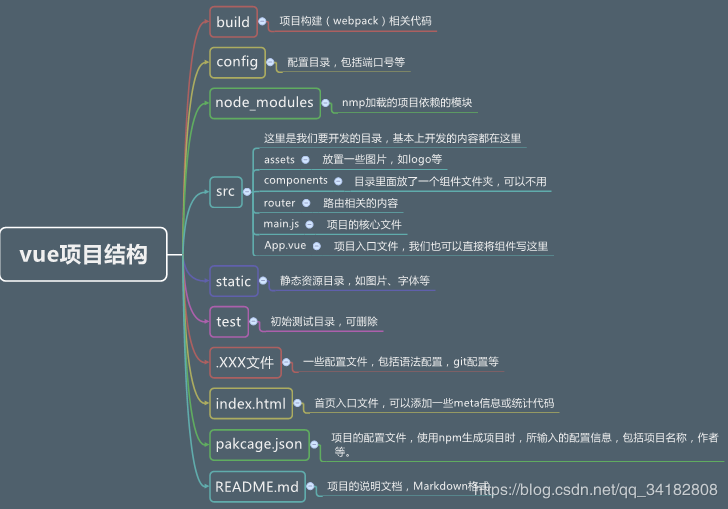

### vue相关教程 
tskill node（停止运行的项目）
* #### vue项目结构 ####
    
* #### vue注册组件 ####  
    - 全局注册（所有实例都可以使用）
        ```
        vue.component('headerTop',{
            template:'<div>header</div>'
        })
        ```
        全局注册的行为必须在根 Vue 实例 (通过 new Vue) 创建之前发生。
    - 局部注册
        ```
        let Child = '<div>child</div>'
        new Vue({
            //页面注册方法
            components:{
                Child
            }
        })
        ```


    ps：组件中data必须是函数
        ``` vue
        Vue.component({
            template:'<div>{{counter}}</div>,
            data:function(){
                return {counter:0}
            }
        })
        export default {
            components: {
                ComponentA
            }
        }
        ```
* #### axios封装使用 #### 
    request/http.js
        ```axios本身返回promise对象。
        const axios = require('axios')
        const request = function (url,type,params){
            return axios({
                baseURL:'https://elm.cangdu.org/v1',
                url:url,
                method:type,
                params:params
            })
        }
        export default request
        ```
        request/api.js
        ```
            import request from './http'
            const cityApi = ()=>{ return request('/cities?type=guess','Get') }
            export {cityApi}
        ```
* #### vue教程 ####    
    * ##### vue常见用法 #####
        - v-for
            ```
            <ul>
                <router-link tag="li" to="" v-for="item in hotcity" :to="'/city/' + item.id" :key="item.id">
                    {{item}}
                </router-link>
            </ul>
            //key是独一无二的,!!key的作用
            ```
            ```
            //获取key,index
            <li v-for="(item,name,index) in items"></li>
            ```
        - v-bind
            用于属性绑定，属性值为变量
            v-bind:src="imgSrc"
        - 计算属性和侦听器
            - 计算属性和侦听器 vs methods
            ```
                computed:{
                    reversedMessage(){
                        return this.message.split('').reverse().join('')
                    }
                }
            ```
            与methods的区别：computed会基于依赖缓存，例如，只有message改变了，才会重新求值。
            - 计算属性 vs 侦听属性
            - 计算属性的setter
                默认只有getter，可以提供一个setter
                ```
                    // ...
                    computed: {
                        fullName: {
                            // getter
                            get: function () {
                            return this.firstName + ' ' + this.lastName
                            },
                            // setter
                            set: function (newValue) {
                            var names = newValue.split(' ')
                            this.firstName = names[0]
                            this.lastName = names[names.length - 1]
                            }
                        }
                    }
                    // ...
                ```
        - 侦听器(watch)
            类型：{ [key: string]: string | Function | Object | Array }
            vm.$watch('a.b.c', function (newVal, oldVal) {
                // 做点什么
            })
            ```
                watch:{
                    question:function(){
                        this.getAnswner
                    }
                }
                //question变化后触发函数。
                watch:{
                   question:{
                       handler:function(){
                           this.getAnswner
                       },
                       deep:true,//是否监听对象内部的变化。
                        immediate: true//刷新页面立即触发回调函数，oldVal为undefined.
                   } 
                }
            ```
        - 条件渲染
            - v-if（可以与v-else-if 和 v-else配合使用）
                ``` html
                    <template v-if="ok">
                        <h1 v-if="title">Title</h1>
                        <h3 v-else>subTitle</h3>
                    </template>
                ```
                ``` html
                    <div v-if="type === 'A'">
                    A
                    </div>
                    <div v-else-if="type === 'B'">
                    B
                    </div>
                    <div v-else-if="type === 'C'">
                    C
                    </div>
                    <div v-else>
                    Not A/B/C
                    </div>
                ```
                ``` html
                //添加了key之后，切换显示，value会清空
                <template v-if="loginType === 'username'">
                    <label>Username</label>
                    <input placeholder="Enter your username" key="username-input">
                </template>
                <template v-else>
                    <label>Email</label>
                    <input placeholder="Enter your email address" key="email-input">
                </template>
                ```
            - v-show vs v-if
                1、v-show不支持template元素
                2、v-if是惰性的，为真时才渲染
                3、频繁切换时建议用v-show
        - 插槽(调用模板a的组件b可以向模板a插入不同的内容，可以指定位置)
            - 具名插槽
                ```
                    //组件a接收插槽
                    <slot name="header"></slot>
                    //组件b向具名slot提供内容
                    <template v-slot:header>
                        <span class="fl">ele.me</span>
                    </template>
                    ps：v-slot只能添加在template里。
                    //没有命名的
                    v-slot:default
                ```
            - 作用域插槽
                组件b如何获取模板a中的数据
                ``` 
                    //a
                    <slot name="header" :user=user></slot>
                    //b
                    <template v-slot:header="propParams">
                        <span class="fl">{{propParams.user}}</span>
                    </template>
                ```
            - 缩写
                ```
                    <template #header="propParams">
                        <span class="fl">{{propParams.user}}</span>
                    </template>
                ```
        - prop
            父子组件传值
            ```
                //父页面（在html注意转换成短横线分割命名
                //相当于传递sign-up属性，注意是否是静态的string。
                <headerTop signin-up="home">

                </headerTop>
                //动态传值,传入数值、数组、对象，需要使用v-bind,即使是静态值，v-bind子页面定义的props。
                <headerTop :signin-up="post.id">

                </headerTop>
                //子页面 加引号
                props: ['signinUp']
            ```
        - Class 与 Style 绑定
        ```
            //对象语法
            <div v-bind:class="{ active: isActive }"></div>
            data: {
                isActive: true,
                error: null
            }
            //数组写法
            <div v-bind:class="[ class1,class2]"></div>
            data: {
                class1: 'active',
                class2: 'error'
            }
        ```
    * ##### 可复用性/组合 #####
        - 混入
            可用于data、created、methods等混入；
            实现复用方法、数据等。
            ```
                //mixin.js
                export const getFoo = {
                    methods:foo(){
                        console.log('foo')
                    }
                }
                //父组件
                import getFoo from...
                {
                    mixins:[getFoo]
                }
                //ps：mixins不用加引号，vuex需要加引号。
            ```
    * ##### 进入/离开 & 列表过渡 #####
        -
* #### vue api ####
    - 全局api
        - Vue.nextTick( [callback, context] )
        理解：数据变化之后，立即调用该回调函数；注意：Vue 实现响应式并不是数据发生变化之后 DOM 立即变化，而是按一定的策略进行 DOM 的更新。$nextTick 是在下次 DOM 更新循环结束之后执行延迟回调，在修改数据之后使用 $nextTick，则可以在回调中获取更新后的 DOM。

* #### vue 相关插件 ####
    - swiper
    https://www.npmjs.com/package/vue-awesome-swiper
    https://github.com/surmon-china/vue-awesome-swiper